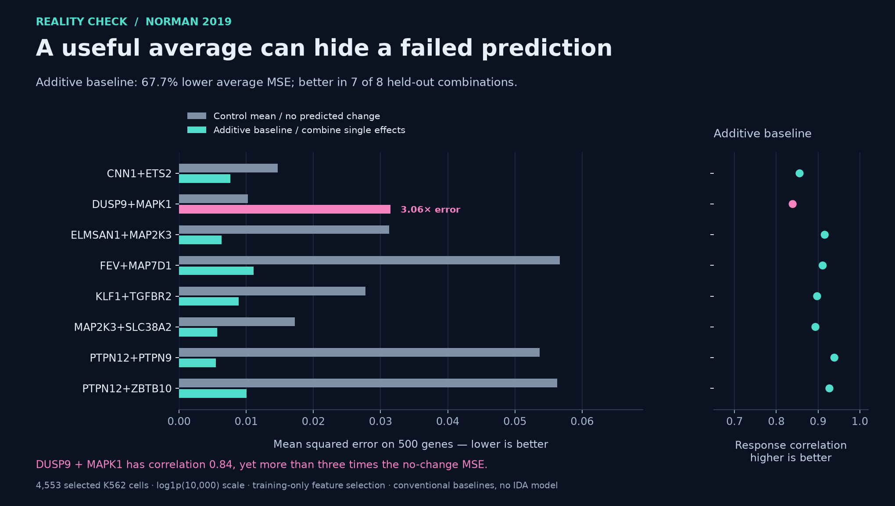

# Pertpy contribution: a fair test for biological prediction

We built a working evaluator that compares predictions of cellular responses
with simple baselines, catches misleading comparisons, and preserves failed or
undefined scores. It is a concrete response to the evaluation infrastructure
requested in [Pertpy issue #1035](https://github.com/scverse/pertpy/issues/1035).

The [contribution is submitted as Pertpy PR #1098](https://github.com/scverse/pertpy/pull/1098)
for maintainer review. The tested implementation is committed on the
[clean feature branch](https://github.com/thantiklermcirony/pertpy/tree/feat/perturbation-evaluator).
No maintainer acceptance or merge is claimed.

**What researchers get.** `pt.tl.PerturbationEvaluator` provides explicit
perturbation, combination and context holdouts; gene alignment by identifier;
training-only control-mean and additive baselines; and five metrics with explicit
status, group counts, measurement choice and reproducibility metadata. Missing
predictions remain visible. Test controls cannot fit a baseline. Known aliases
of a combination can be held out together.

**The actual experiment.** We prepared 4,553 cells and 500 training-selected genes
from the public processed Norman 2019 dataset. Controls and single interventions
contributed 2,953 training cells. Eight joint interventions contributed 1,600
held-out cells, with no selected combination cells in training. We used the
published count normalization and excluded the documented problematic control
construct. Original data and processing: [Norman et al.](https://doi.org/10.1126/science.aax4438),
[Theis lab dataset table](https://github.com/theislab/sc-pert/blob/main/data_table.csv),
[processing notebook](https://github.com/theislab/sc-pert/blob/main/datasets/Norman_2019.ipynb).

| Result | Value |
| --- | ---: |
| Control-mean baseline, mean MSE across eight combinations | 0.0334860 |
| Additive baseline, mean MSE across eight combinations | 0.0108292 |
| Reduction in macro mean MSE | 67.7% |
| Combinations where additive MSE is lower | 7 of 8 |
| Additive mean delta Pearson correlation | 0.8975 |

These are conventional baseline results. IDA has not been implemented or scored
in this experiment. The 67.7% figure is the reduction in the ratio of macro mean
MSEs, not a mean of condition-wise percentage reductions or a general performance
claim about biological prediction.

**Why multiple metrics matter.** DUSP9+MAPK1 has additive response correlation
0.839, but MSE 0.031472 versus 0.010276 for the no-change baseline: **3.06 times
the error**. A good-looking correlation alone would hide this failure. This is a
useful case for subsequent research, not a new biological discovery or a held-out
target that may now be tuned on and reused as independent confirmation.

**Checks completed.** The [final Linux run](https://github.com/thantiklermcirony/pertpy/actions/runs/34415474373)
passed 84 evaluator cases on each of Python 3.12.3 and 3.14.7: 44 contribution
cases and 40 independently written audit cases. Two existing comparison tests
also passed on each interpreter. The real-data run passed 32 independent MSE
and E-distance comparisons and a gene-order invariance check. A separate
calculation using `math.fsum`, with no Pertpy imports, matched all 32 MSE/Pearson
value/status comparisons within 2.22e-16.

The [whole-project checks](https://github.com/thantiklermcirony/pertpy/actions/runs/34415474369)
passed type checking across 101 source files, applicable pre-commit hooks and
the full documentation build with warnings treated as errors. Tests found and
fixed numerical overflow and sparse-reduction precision problems during
development. Full-project mypy follows the existing configuration; it does not
check unannotated function bodies by default. This was not a run of every
optional/data-dependent test in Pertpy.

**Scope and limits.** This first API implements mean/additive baselines and MSE,
E-distance, delta correlation, direction agreement and top-k response overlap.
Nearest-neighbour baselines and log-fold-change scoring remain proposed extensions
requiring explicit input contracts. Top-k overlap is not a DEG significance test.
An exact-label holdout is not atomic-target cold start. Declared cell-ID disjointness
does not certify an external model's training history. The dataset is one K562
context, uses inherited global gene filtering, and contains technical lanes rather
than independent biological replicates. Point baselines do not model cell variation.

**What this gives the programme.** We now have a credible way to test IDA against
real experimental responses and strong, transparent simple baselines. The next
scientific step is to define IDA's predictor, training inputs and falsifiable
advantage before examining new held-out results. Maintainer review of the software
and independent predictive evidence are separate next steps.

The [reproduction instructions](Reproduce_Pertpy_Evaluation.md),
[all 80 score rows](norman-scores.csv), [source and artifact hashes](source-manifest.json),
and [independent comparison](linux-oracle-comparison.json) accompany this report.
Raw data is not redistributed. The five clean-branch files at `4ebb42a3d0418225d73c74cf81007b137d75ab83` are
byte-identical to the tested audit files at `1ce7cab302b30077cc283fabc3cebd5c4a18c92b`.
